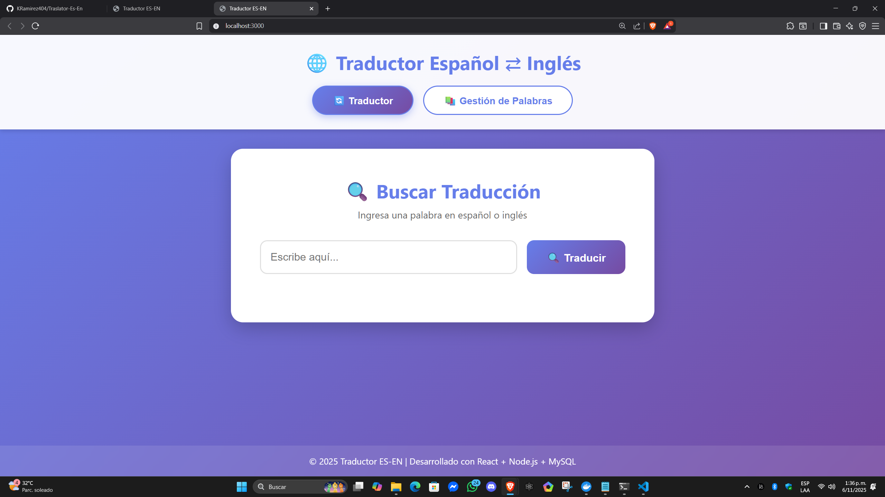
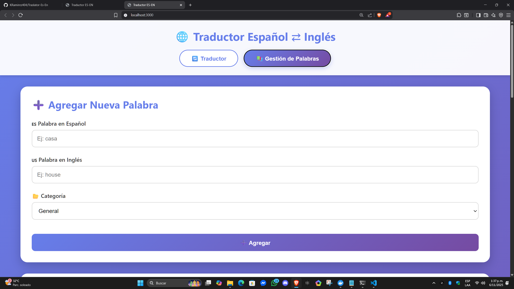
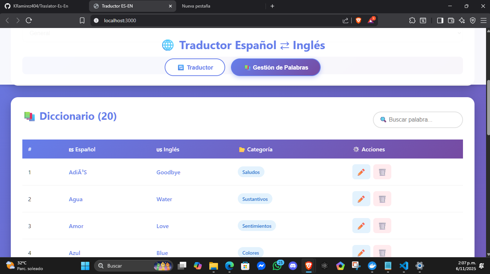

# 🌐 Traductor Español-Inglés

Aplicación web completa para traducción bidireccional español-inglés con sistema CRUD para gestión de palabras.

## 📋 Características

- ✅ **Traductor bidireccional** (Español ⇄ Inglés)
- ✅ **CRUD completo** para gestión de palabras
- ✅ **Categorización** de palabras (saludos, verbos, sustantivos, etc.)
- ✅ **Búsqueda en tiempo real** 
- ✅ **Interfaz moderna y responsive**
- ✅ **API RESTful** con Node.js + Express
- ✅ **Base de datos MySQL**
- ✅ **Frontend en React**

## 🛠️ Tecnologías Utilizadas

### Backend
- Node.js
- Express.js
- MySQL (mysql2)
- CORS
- dotenv

### Frontend
- React
- Axios
- CSS3

## 📁 Estructura del Proyecto

```
Traslator-Es-En/
├── backend/
│   ├── config/
│   │   └── database.js          # Configuración de MySQL
│   ├── controllers/
│   │   └── traduccionesController.js  # Lógica de negocio
│   ├── routes/
│   │   └── traducciones.js      # Rutas de la API
│   ├── database/
│   │   └── schema.sql           # Esquema de base de datos
│   ├── .env                     # Variables de entorno
│   ├── .env.example             # Variables de entorno (plantilla)
│   ├── package.json
│   └── server.js                # Servidor Express
│
├── frontend/
│   ├── public/
│   │   └── index.html
│   ├── src/
│   │   ├── components/
│   │   │   ├── Traductor.js     # Componente traductor
│   │   │   ├── Traductor.css
│   │   │   ├── GestionPalabras.js  # Componente CRUD
│   │   │   └── GestionPalabras.css
│   │   ├── services/
│   │   │   └── api.js           # Servicios API
│   │   ├── App.js
│   │   ├── App.css
│   │   ├── index.js
│   │   └── index.css
│   └── package.json
│
├── docker-compose.yml           # Configuración de Docker
└── README.md
```

## 🚀 Instalación y Configuración

### Prerrequisitos
- Node.js (v14 o superior)
- Docker y Docker Compose (para MySQL)
- npm o yarn

### 1️⃣ Configurar Base de Datos (Docker)

La forma más fácil es usar Docker Compose que ya está configurado:

```powershell
# Iniciar MySQL en Docker (esto también importa automáticamente el schema.sql)
docker-compose up -d

# Verificar que el contenedor esté corriendo
docker ps

# Ver logs de MySQL (opcional)
docker-compose logs mysql
```

La base de datos se creará automáticamente con:
- **Database:** traductor_db
- **Usuario:** traductor_user
- **Contraseña:** traductor_pass
- **Puerto:** 3306

El archivo `schema.sql` se importa automáticamente al iniciar el contenedor por primera vez.

#### Comandos útiles de Docker:

```powershell
# Detener el contenedor
docker-compose down

# Detener y eliminar volúmenes (borra todos los datos)
docker-compose down -v

# Reiniciar el contenedor
docker-compose restart

# Acceder a MySQL desde la terminal
docker exec -it traductor_mysql mysql -u traductor_user -ptraductor_pass traductor_db
```

#### Alternativa: MySQL local sin Docker

Si prefieres usar MySQL instalado localmente:

```sql
-- Ejecutar en MySQL
CREATE DATABASE traductor_db;
USE traductor_db;

-- Ejecutar el archivo schema.sql
source backend/database/schema.sql
```

Luego edita `backend/.env` con tus credenciales locales.
Verifica que el archivo .env este dentro de la ruta `backend/.env`

Asegurate de crear  el archivo .env dentro de la carpeta backend
tal como se muestra en la ruta `backend/.env`

### 2️⃣ Configurar Backend

```powershell
# Navegar a la carpeta backend
cd backend

# Instalar dependencias
npm install

# El archivo .env ya está configurado para Docker
# Si usas MySQL local, edita backend/.env con tus credenciales:
# DB_HOST=localhost
# DB_USER=root
# DB_PASSWORD=tu_password
# DB_NAME=traductor_db
# DB_PORT=3306
# PORT=5000

# Iniciar servidor
npm start

# O con nodemon (desarrollo)
npm run dev
```

El servidor estará corriendo en `http://localhost:5000`

**Nota:** Si obtienes error de conexión, espera unos segundos a que MySQL termine de iniciar completamente.

### 3️⃣ Configurar Frontend

```powershell
# Abrir nueva terminal y navegar a frontend
cd frontend

# Instalar dependencias
npm install

# Iniciar aplicación React
npm start
```

La aplicación estará disponible en `http://localhost:3000`

## 📡 API Endpoints

### Obtener todas las traducciones
```
GET /api/traducciones
```

### Obtener traducción por ID
```
GET /api/traducciones/:id
```

### Traducir palabra
```
GET /api/traducciones/traducir/:palabra
```

### Crear nueva traducción
```
POST /api/traducciones
Body: {
  "palabra_espanol": "casa",
  "palabra_ingles": "house",
  "categoria": "sustantivos"
}
```

### Actualizar traducción
```
PUT /api/traducciones/:id
Body: {
  "palabra_espanol": "casa",
  "palabra_ingles": "home",
  "categoria": "sustantivos"
}
```

### Eliminar traducción
```
DELETE /api/traducciones/:id
```

## 🎯 Uso de la Aplicación

### Módulo Traductor
1. Ingresa una palabra en español o inglés
2. Haz clic en "Traducir"
3. Obtén la traducción y categoría

### Módulo Gestión de Palabras
1. **Agregar**: Completa el formulario y haz clic en "Agregar"
2. **Editar**: Haz clic en el icono ✏️ de la palabra
3. **Eliminar**: Haz clic en el icono 🗑️ y confirma
4. **Buscar**: Usa la barra de búsqueda para filtrar palabras

## 🎨 Capturas de Pantalla

### Traductor
- Interfaz intuitiva con diseño moderno
- Traducción bidireccional instantánea






### Gestión de Palabras
- Tabla completa con todas las palabras
- Formulario para agregar/editar
- Búsqueda en tiempo real

## 🔧 Configuración Adicional

### Cambiar puerto del backend
Editar `backend/.env`:
```
PORT=3001
```

### Cambiar URL de API en frontend
Editar `frontend/src/services/api.js`:
```javascript
const API_URL = 'http://localhost:3001/api/traducciones';
```

## 📝 Datos de Ejemplo

La base de datos incluye 20 palabras de ejemplo en diferentes categorías:
- Saludos
- Sustantivos
- Verbos
- Colores
- Animales
- Sentimientos

## 🐛 Solución de Problemas

### Error de conexión a MySQL (Docker)
- Verificar que el contenedor esté corriendo: `docker ps`
- Verificar logs del contenedor: `docker-compose logs mysql`
- Esperar a que MySQL termine de iniciar (puede tomar 30-60 segundos)
- Reiniciar el contenedor: `docker-compose restart`

### Error de conexión a MySQL (Local)
- Verificar que MySQL esté corriendo
- Verificar credenciales en `.env`
- Verificar que este usando la contraseña correcta(darle un vistazo al docker-compose.yml)
- Verificar que la base de datos exista

### Error CORS
- Verificar que el backend esté corriendo
- El frontend debe estar en `http://localhost:3000`

### Error al instalar dependencias
```powershell
# Limpiar caché de npm
npm cache clean --force

# Eliminar node_modules y reinstalar
rm -r node_modules
npm install
```

## 👨‍💻 Desarrollo

### Agregar nuevas categorías
Editar en `frontend/src/components/GestionPalabras.js` el select de categorías.

### Modificar estilos
Los archivos CSS están en cada componente para fácil personalización.

## 📄 Licencia

Este proyecto es de código abierto.

## 🤝 Contribuciones

Las contribuciones son bienvenidas. Por favor:
1. Fork el proyecto
2. Crea una rama para tu feature
3. Commit tus cambios
4. Push a la rama
5. Abre un Pull Request

## 📧 Contacto

Para preguntas o sugerencias, abre un issue en el repositorio.

---

Desarrollado con ❤️ usando React, Node.js y MySQL
